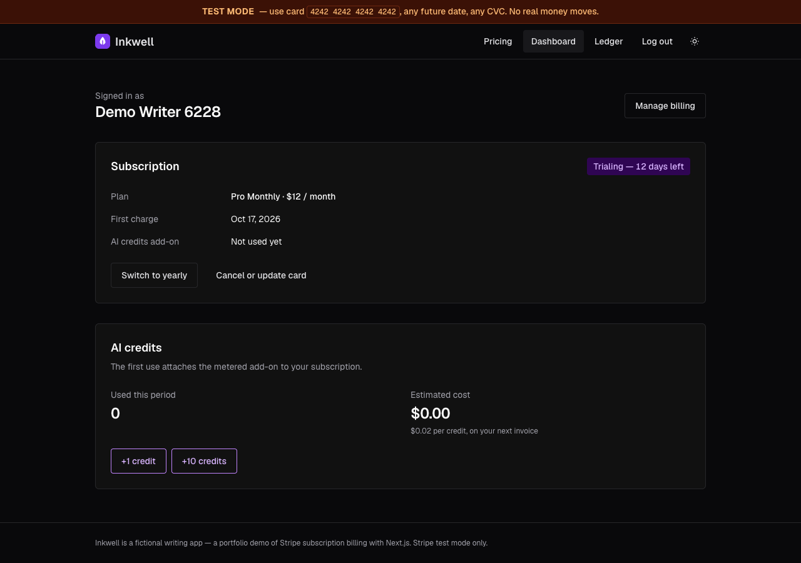
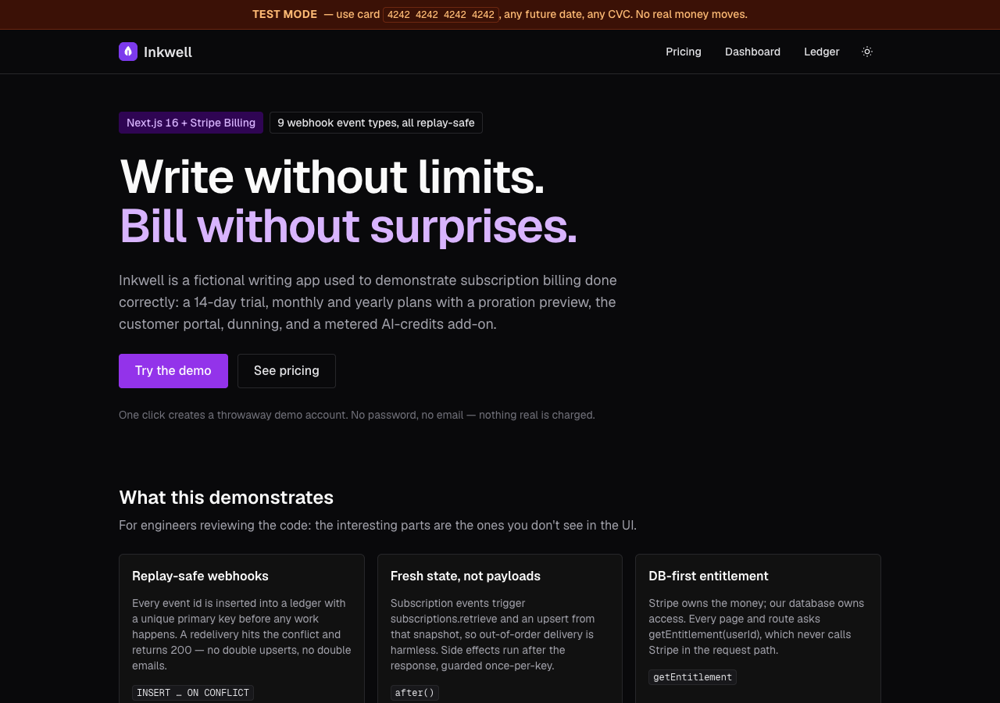
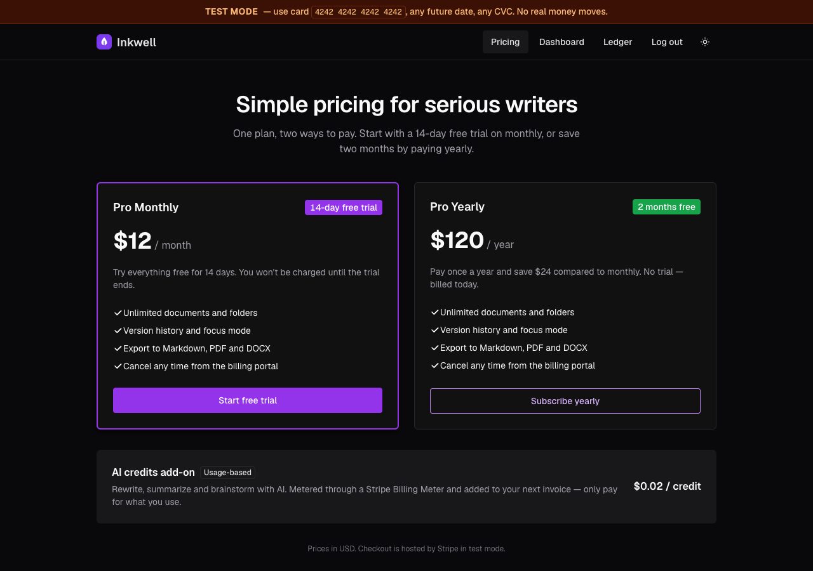
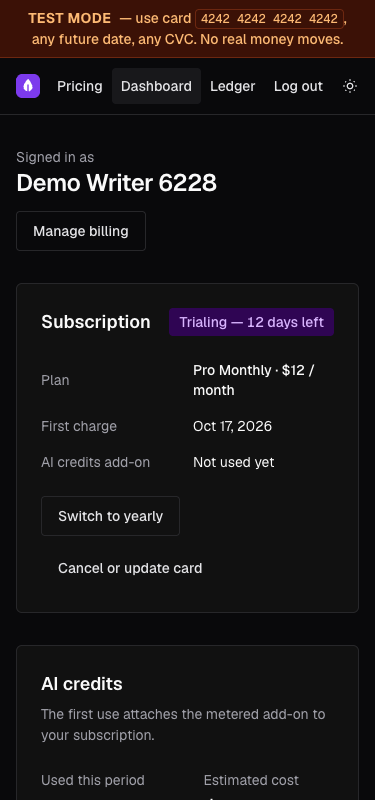
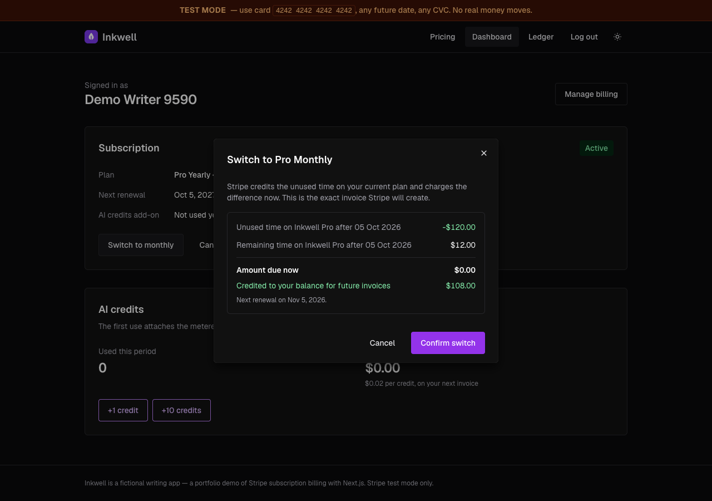
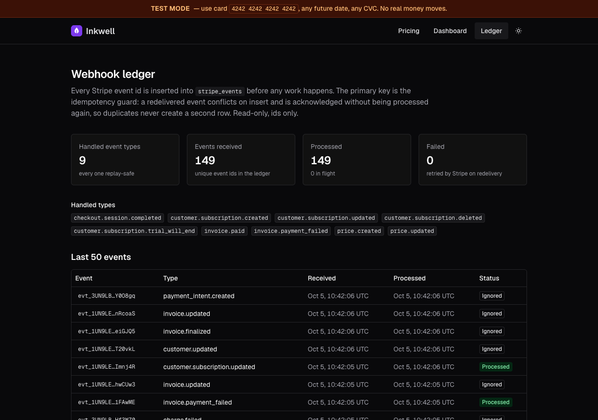

# Subscription Billing Starter

**Live:** https://subscription-billing-starter.vercel.app



Next.js + Stripe subscriptions done the way production needs them: Checkout with a 14-day trial, plan changes with a proration preview, the Customer Portal, dunning, a metered usage add-on, and **webhooks that are safe to replay and safe to receive out of order**, all verified with tests and Stripe test clocks. The product being sold is "Inkwell", a fictional writing app.

**Try it:** open the [live demo](https://subscription-billing-starter.vercel.app), press **Try the demo** (no sign-up; a throwaway demo user is created), subscribe with card `4242 4242 4242 4242`, any future date, any CVC. It runs in Stripe **test mode**; no real money moves. `/admin` shows the live webhook ledger.

**The number:** _9 webhook event types handled, every one replay-safe, 79 tests, verified end to end with Stripe test clocks (23 checks)._

## Why

Taking a first payment is easy. What breaks billing in production is everything after it: Stripe delivers webhooks **at least once** and **in no particular order**, a handler that crashes halfway must be retried without sending a second email, a trial converts to paid 14 days after anyone last looked at the code, and a "is this user Pro?" check that calls Stripe on every request turns a Stripe hiccup into an outage. This repo is the part every SaaS gets wrong the first time, done once properly and tested.

## Architecture

- **Two sources of truth, never mixed.** Stripe owns money; the database owns access. `getEntitlement(userId)` reads only Postgres and everything in the app asks it. No request computes access from a live Stripe call. The one exception is a documented fallback: right after Checkout, the success page may sync the user's own customer once if the webhook hasn't landed yet.
- **Idempotency is an `INSERT`, not an `if`.** The webhook verifies the signature on the raw body, then inserts the event id into `stripe_events`, whose primary key is the event id. A conflict means "already handled": return 200 and stop. A "have I seen this?" `SELECT` would race between two concurrent deliveries.
- **The payload is never trusted for state.** For every subscription-related event the handler re-fetches the subscription with `stripe.subscriptions.retrieve` and upserts that. An `updated` event that arrives before `created`, or a stale replay, converges on Stripe's current view. Syncs of one subscription run under a transaction-scoped advisory lock, so a slower, older retrieve can't land last.
- **Side effects run once, after the 200.** Emails go out in Next's `after()` behind a `side_effects` key (e.g. `email:payment_failed:in_…`). A replayed event never sends twice. If an email fails, the event is un-marked and retried, rather than silently acknowledged.
- **Failures stay retryable.** A crashed handler leaves the ledger row with `error` set and the route answers 500, so Stripe retries. A redelivery that arrives while another attempt holds a fresh claim gets **409**, not 200, so Stripe keeps trying in case the first attempt dies.

Events handled (`lib/webhooks/events.ts`): `checkout.session.completed`, `customer.subscription.created / updated / deleted / trial_will_end`, `invoice.paid`, `invoice.payment_failed`, `price.created / updated`.

## Billing details worth noting

- **One trial per user.** Checkout adds `trial_period_days: 14` only for monthly and only if this user never had a subscription. Before creating a session it also asks Stripe for live subscriptions the webhook hasn't delivered yet, and expires older open sessions. If two Checkouts still complete in parallel, the webhook keeps the first subscription and cancels and refunds the second.
- **Proration preview equals the charge.** `invoices.createPreview` with `proration_behavior: "always_invoice"` previews exactly what `subscriptions.update` then charges. With `create_prorations` the preview shows the next renewal invoice instead ($228 vs the $108 actually charged in a monthly → yearly test). Plan changes use `payment_behavior: "pending_if_incomplete"`, so a declined card leaves the customer on their old plan instead of half-switched.
- **Metered add-on through Billing Meters.** The first use attaches the "AI credits" price to the subscription. Each use is written to `usage_events` with a client idempotency key **before** being sent as a meter event, so a retried click is never billed twice.
- **Current Stripe API.** `current_period_*` lives on subscription items, the invoice → subscription link is `invoice.parent.subscription_details`, and upcoming-invoice previews are `invoices.createPreview`. Older tutorials use fields that no longer exist.
- **The Customer Portal configuration is code, not dashboard clicks.** `pnpm stripe:setup` idempotently creates the product, prices (by `lookup_key`), the meter and the portal configuration (monthly ↔ yearly switch with proration, card update, invoices, cancel at period end).

## Tests

Three layers. Details in [docs/testing.md](docs/testing.md).

| Layer | Proves |
| --- | --- |
| `pnpm test` (Vitest, 79 tests, real Postgres) | Replay → one ledger row, one upsert, one email. Out-of-order → final state equals the fresh retrieve. Failed handler retried. Signature failures. Checkout trial rules. IDOR, CSRF and rate-limit guards, demo cleanup. Usage idempotency. Fixtures are **real events recorded from the test account**, not hand-written JSON. |
| `stripe listen` + `stripe trigger` / `stripe events resend` | The real route with real signatures. A resent, already-processed event is answered in 12 ms with zero effects. |
| `pnpm test:clock` | Against real Stripe: a customer on a **test clock** starts a 14-day trial, the clock advances 15 days, every resulting event goes through the webhook handler **twice** → active, invoice paid $12, one ledger row per event. Then a failing card → `past_due`, exactly one dunning email. 23/23 checks pass; the clocks are deleted afterwards. |

## Run it

```bash
pnpm install
cp .env.example .env.local          # Stripe TEST keys, SESSION_SECRET (DB URLs already point at db:local)
pnpm db:local                       # Postgres on :5435 with `billing` and `billing_test` (own terminal), or use Neon
pnpm db:migrate
pnpm stripe:setup                   # product, prices, meter, portal config (idempotent)
pnpm stripe:listen                  # forwards webhooks to localhost:3000 (own terminal)
pnpm dev
pnpm test                           # needs TEST_DATABASE_URL; DB tests are skipped with a warning without it
```

## Security and abuse limits

The demo is public, so:

- Session cookies are HMAC-signed, `HttpOnly`, `SameSite=Lax`. Every signed-in write also refuses cross-site requests (`Origin` / `Sec-Fetch-Site`) and only reads `application/json` bodies.
- Demo sign-ups are rate-limited per IP and capped globally per hour (`DEMO_HOURLY_CAP`). Every route that calls Stripe has a per-user limit (429 with `Retry-After`), and AI credits are capped per billing period.
- Demo users expire after 7 days: new sign-ups periodically delete a batch of expired users (and their Stripe test customers) after the response (`lib/demo-cleanup.ts`).
- Security headers (`X-Frame-Options`, CSP `frame-ancestors`, `nosniff`, `Referrer-Policy`, `Permissions-Policy`) are set in `next.config.ts`. The app refuses live Stripe keys.

## Screenshots

| Landing | Pricing | Mobile |
| --- | --- | --- |
|  |  |  |

| Proration preview | Webhook ledger |
| --- | --- |
|  |  |

## What I'd do next

- Real auth (Auth.js with email or OAuth) in place of demo users. Entitlement doesn't change.
- A queue for side effects (e.g. Inngest or a Postgres job table) instead of `after()` plus a retry sweep.
- Stripe Tax and invoices with a VAT number for EU customers.
- Seat-based pricing for a Team plan (quantity changes with proration).
- Alerting on ledger rows stuck with `error` set.

## License

[MIT](LICENSE)
